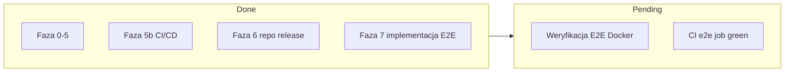

# awesome-pushup-standards — Plan repozytorium (kompletny dokument projektowy)

## TL;DR

- `awesome-pushup-standards` to kuratorski zbiór pluginów i presetów dla code-pushup CLI, w którym code-pushup pełni rolę warstwy orkiestrującej ("guru") nad wszystkimi narzędziami jakości.
- Repo definiuje dwa typy pluginów: heurystyczne/statyczne (wykrywanie obecności/braku narzędzi) oraz opcjonalne LLM-owe (ocena rubryczna mapowana na score 0–1), oraz domeny wykraczające poza języki (architektura, API, React, walidacja, bezpieczeństwo, Docker, dokumentacja, CI/CD).
- Dokument zawiera pełne drzewo katalogów, listę pluginów per domena, definicje presetów z wagami, model kontrybucji, roadmapę fazową oraz konkretną instrukcję dla agenta AI bootstrapującego repo.

## Filozofia (philosophy)

`code-pushup` nie zastępuje narzędzi jakości — on je **orkiestruje**. Każde narzędzie (ESLint, ruff, clippy, clang-tidy, Spectral, hadolint, trivy) produkuje wynik, a code-pushup zbiera je, mapuje na audyty (audits) o score 0–1, grupuje (groups) i agreguje w kategorie (categories) z wagami (weights). Dzięki temu zespół widzi jeden spójny scoreboard i trendy zamiast dziesięciu osobnych raportów CI.

Trzy filary:

1. **code-pushup jako orkiestrator (guru).** Repo nie wymyśla nowych analizatorów — opakowuje najlepsze istniejące narzędzia w jednolity model audytów.
2. **Presety wymuszają wysokie standardy.** Profil taki jak `python-backend-strict` to gotowy zestaw pluginów + kategorii + wag, który podnosi poprzeczkę bez ręcznej konfiguracji.
3. **Sugestie skoków jakościowych (quality leaps).** Pluginy heurystyczne wykrywają brak najlepszych praktyk (brak `pydantic`, brak `zod`, brak TypeScript) i sugerują adopcję, zamiast tylko karać za istniejące błędy.

Ważne: code-pushup z założenia **nie blokuje CI** ("Non-blocking: we give you more visibility, but don't get in your way (no failing CI)") — mierzy i pokazuje trendy. To pozwala ustawiać aspiracyjne cele, a nie arbitralne progi pass/fail.

## Key Findings

### Jak działa code-pushup (model pluginów)

Na podstawie `@code-pushup/models` (models-reference.md) i oficjalnego guide'u custom-plugins:

- **PluginConfig** — pola wymagane: `slug`, `title`, `icon`, `runner`, `audits` (min. 1). Pola opcjonalne: `description`, `docsUrl`, `groups`, `packageName`, `version`, `isSkipped`, `scoreTargets`, `context`.
- **Slug** — string pasujący do regex `/^[a-z\d]+(?:-[a-z\d]+)*$/`, max 128 znaków. Ten sam typ używany dla pluginów, audytów, grup, kategorii.
- **Audit** (metadane): `slug` (_), `title` (_), `description`, `docsUrl`, `isSkipped`.
- **AuditOutput** (zwracane przez runner): `slug` (_), `value` (_, `NonnegativeNumber` ≥ 0), `score` (\*, `Score` = liczba 0–1), `displayValue` (np. `'2.1 MB'`), `details`.
- **AuditDetails**: `issues`, `table`, `trees` (wszystkie opcjonalne).
- **Issue**: `message` (_, max 1024), `severity` (_: `'info' | 'warning' | 'error'`), `source` (opcjonalny). `SourceFileLocation` ma `file` (_) i `position` z `startLine` (_), `startColumn`, `endLine`, `endColumn`.
- **Runner** w dwóch formach:
  - `RunnerConfig` — `command` (_), `args`, `outputFile` (_), `outputTransform`, `configFile`. Wykonuje shell-command (np. uruchamia `ruff --output-file=...`).
  - `RunnerFunction` — sygnatura `(args: RunnerArgs) => AuditOutputs | Promise<AuditOutputs>`. Prostszy, pisany inline w TS/ESM.
- **Group**: `slug` (_), `title` (_), `refs` (\*, min 1 `GroupRef`). `GroupRef` = `{ slug, weight }` (referencja do audytu w TYM SAMYM pluginie, bez `type`/`plugin`).
- **CategoryRef** (referencja cross-plugin): `{ type: 'audit' | 'group', plugin, slug, weight }`. Waga `0` = tylko informacyjnie, bez wpływu na score.
- Helpery z `@code-pushup/utils`: `crawlFileSystem`, `pluralizeToken`, `factorOf`, `formatBytes`, `objectToCliArgs`, `executeProcess`, `readJsonFile`, `slugify`.

Mapowanie score jest binarne lub proporcjonalne w zależności od pluginu — np. ESLint: score = 1 jeśli brak błędów/ostrzeżeń, inaczej 0; coverage: score = pokrycie/100 (0–1); jsdocs: score = udokumentowane/wszystkie.

### Oficjalne pluginy code-pushup

Z repozytorium `code-pushup/cli` (packages) oraz npm:

- `@code-pushup/eslint-plugin` — statyczna analiza przez reguły ESLint; reguły mapowane na audyty, grupy `problems`/`suggestions`/`formatting`.
- `@code-pushup/coverage-plugin` — pokrycie kodu z plików LCOV; audyty `line-coverage`, `branch-coverage`, `function-coverage`.
- `@code-pushup/js-packages-plugin` — audyt zależności (npm/yarn/pnpm audit) i outdated; grupy `npm-audit`, `npm-outdated`.
- `@code-pushup/lighthouse-plugin` — wydajność/best practices web; mapuje kategorie Lighthouse na grupy.
- `@code-pushup/jsdocs-plugin` — pokrycie dokumentacji JSDoc; audyt `percentage-coverage`.
- `@code-pushup/typescript-plugin` — błędy kompilatora TS przy ścisłych flagach.
- `@code-pushup/axe-plugin` — dostępność (WCAG) przez axe-core + Playwright; grupy wg kategorii axe.

### Community-plugins

Repo `code-pushup/community-plugins` to monorepo Nx (TypeScript ~89%, JavaScript ~5,2%, HTML ~4,2%) z folderem `packages/`, używa Vitest, Verdaccio (lokalny rejestr npm) i ma `CONTRIBUTING.md` z minimalnymi wymaganiami dla pluginów. README wskazuje oficjalne pluginy w `code-pushup/cli/tree/main/packages` jako wzorce referencyjne. Repo jest młode (1 gwiazdka, niewiele wydań).

### Najlepsze narzędzia jakości per domena (2025/2026)

- **Python**: ruff z ponad 900 regułami, per oficjalna dokumentacja Astral (docs.astral.sh/ruff): „Ruff supports over 900 lint rules, many of which are inspired by popular tools like Flake8, isort, pyupgrade"; reguły re-implementowane z 50+ narzędzi (m.in. kategoria `S` = bandit). Dalej: mypy / ty (type checker od Astral — twórców uv i Ruff: „Ruff is backed by Astral, the creators of uv and ty"), pytest + pytest-cov, bandit, pip-audit. Standard konfiguracji: `pyproject.toml`. Menedżer: uv.
- **Rust**: clippy (`cargo clippy -- -D warnings`), rustfmt, cargo-audit (RustSec), cargo-deny, cargo-tarpaulin (pokrycie), cargo-modules (struktura modułów).
- **JS/TS**: ESLint, TypeScript (strict), Vitest, dependency-cruiser (architektura), knip (martwy kod).
- **C++**: clang-tidy, cppcheck, clang-format, sanitizers (ASan/UBSan/MSan), oraz clazy dla Qt. clazy (projekt KDE) — per opis projektu (analysis-tools.dev / KDE/clazy): „You get more than 50 Qt related compiler warnings, ranging from unneeded memory allocations to misusage of API, including fix-its for automatic refactoring"; checki podzielone na poziomy level0/1/2/manual.
- **GTK/GNOME (C)**: zgodność ze stylem GNOME (`G_DECLARE_*`, `G_DEFINE_TYPE_WITH_PRIVATE`, namespacing camelCase↔snake_case), makra `GDK_AVAILABLE_IN_X_Y`, brak trailing whitespace, tab = 8 spacji.
- **OpenAPI/API**: Spectral z wbudowanym rulesetem OpenAPI uruchamianym przez `extends: ["spectral:oas"]` oraz rulesetem OWASP. Spectral OWASP ruleset (`@stoplight/spectral-owasp-ruleset`) bazuje na OWASP API Security Top 10 — v2.x na edycji 2023, v1.x na 2019, per README Stoplight (github.com/stoplightio/spectral-owasp-ruleset): „v2.x of this ruleset is based on the OWASP API Security Top 10 2023 edition". Dalej: Optic (breaking changes), openapi-diff. Wsparcie OAS 3.1 (`deprecated`), wersjonowanie URI path vs header.
- **Docker**: hadolint — reguły z prefiksem DL (np. DL3000 „Use absolute WORKDIR") plus reguły SC z ShellCheck do lintowania bash w instrukcjach RUN, per README (github.com/hadolint/hadolint): „It is standing on the shoulders of ShellCheck to lint the Bash code inside RUN instructions". Dalej: trivy / grype (skan CVE), syft (SBOM CycloneDX/SPDX), Docker Scout.
- **Sekrety/SBOM**: gitleaks (szybki, pre-commit), trufflehog — „800+ credential detectors", per README projektu (github.com/trufflesecurity/trufflehog): „TruffleHog classifies over 800 secret types, mapping them back to the specific identity they belong to"; każdy detektor ma aktywną weryfikację (login do usługi). Dalej: syft + grype.
- **React**: React 19 (Compiler, Server Components), Zustand (state klienta), TanStack Query (state serwera), React Router / TanStack Router, React Hook Form + Zod, axe (a11y).

### Wzorce LLM-in-CI (inspiracja dla pluginów LLM)

CodeRabbit łączy rozumowanie LLM z „40+ integrated static analysis and security tools (linters, SAST scanners, secrets detectors)", per recenzja max-productive.ai (2026): m.in. Pylint, ESLint, Ruff, RuboCop, Clippy, Semgrep, Gitleaks; firma reklamuje skanowanie sekretów przez TruffleHog i IaC przez Trivy. Używa `.coderabbit.yaml`, etykiet severity (Critical/Major/Minor/Trivial), oraz custom pre-merge checks pisanych w języku naturalnym. PR-Agent/qodo i inne stosują rubryki. Kluczowa technika: **structured output** (JSON Schema / strict mode) gwarantuje, że LLM zwraca walidowalny obiekt — co pozwala zmapować ocenę rubryczną na `score` 0–1 code-pushup. Architektura fitness functions (dependency-cruiser, import-linter, ArchUnit) jest komplementarna i też może być wyrażona jako prompt dla LLM, gdy reguła jest zbyt złożona dla parsera.

## Details

### Struktura domen (NIE tylko języki)

Repo organizuje pluginy w domeny tematyczne:

1. **Languages** — Python, Rust, JS/TS, C++, oraz frameworki desktopowe GTK i Qt.
2. **Application structure & architecture** — konwencje layoutu, modularność, reguły zależności (dependency-cruiser dla JS/TS, import-linter dla Python, cargo-modules dla Rust), architecture fitness functions.
3. **API design quality** — best practices REST, obecność i walidacja plików OpenAPI, linting Spectral, schema-first vs code-first, kontrola wersjonowania API.
4. **React** — wersja/wzorce React, struktura komponentów, rekomendowane biblioteki, reguły hooków, dostępność (axe), rozmiar bundla.
5. **Validation libraries (quality leaps)** — wykrywanie/sugerowanie pydantic (Python), zod (TS), TypeScript (dla projektów JS).
6. **Error handling & logging** — standardy obsługi błędów i logowania.
7. **Code quality** — lint/format/typing/complexity/coverage per język.
8. **Security** — SAST per język, audyt zależności, skan sekretów, SBOM.
9. **Docker/containerization** — hadolint, rozmiar obrazu, multi-stage, trivy/grype, docker-compose.
10. **Documentation quality** — README, changelog, license, contributing.
11. **CI/CD quality** — kontrola pipeline'ów.

### Dwa typy pluginów (kluczowe wyzwanie projektowe)

**a) Pluginy heurystyczne/statyczne.** Wykrywają obecność/brak pakietów, plików, sekcji konfiguracji. Przykłady:

- brak sekcji `[tool.mypy]` w `pyproject.toml` → sugeruj mypy;
- `package.json` bez `typescript` → sugeruj migrację na TS;
- brak `openapi.yaml`/`openapi.json` → sugeruj spec API;
- brak `pydantic` w zależnościach projektu FastAPI/Flask → sugeruj walidację pydantic;
- brak `zod` w projekcie TS z formularzami → sugeruj zod.

Implementacja: `RunnerFunction` czytający pliki (`crawlFileSystem`, `readJsonFile`), generujący `AuditOutput` ze `score` binarnym (1 = praktyka obecna, 0 = brak) i `displayValue` typu `"pydantic missing — suggested"`, z `issue` o severity `'warning'` wskazującym plik (`pyproject.toml`).

**b) Pluginy LLM-owe (opcjonalne).** Aktywne tylko gdy skonfigurowano endpoint LLM (lokalny model lub API zewnętrzne). Wykonują ocenę w stylu code review: przegląd architektury, jakość nazewnictwa, sugestie nowoczesnych alternatyw. Mapują ocenę rubryczną na score 0–1.

Konfiguracja LLM:

- Zmienna środowiskowa `PUSHUP_LLM_ENDPOINT` (URL) + `PUSHUP_LLM_API_KEY` + `PUSHUP_LLM_MODEL`.
- Jeśli zmienne nieobecne → plugin **gracefully skip** (zwraca `isSkipped: true` lub audyt ze score informacyjnym/wagą 0 i `displayValue: "LLM not configured — skipped"`).
- Rubryka → score: każdy wymiar rubryki oceniany 0–5; suma normalizowana do 0–1 przez `score = suma_punktów / maks_punktów`. LLM zwraca **structured output** (JSON Schema/strict) z polami `{ dimension, score, justification }[]`, walidowane przez zod przed mapowaniem na `AuditOutput`.

### Pełne drzewo katalogów repozytorium

```
awesome-pushup-standards/
├── README.md                      # nazwa, tagline, filozofia, quick start
├── LICENSE                        # MIT
├── CONTRIBUTING.md                # quality bar dla pluginów, proces PR
├── CHANGELOG.md
├── package.json                   # npm workspaces root (devDeps wspólne)
├── package-lock.json
├── tsconfig.base.json
├── .gitmodules                    # konfiguracja submodułów
├── .github/
│   └── workflows/
│       ├── ci.yml                 # lint+test+build pluginów
│       ├── self-pushup.yml        # repo mierzy samo siebie (dogfooding)
│       └── release.yml            # publikacja pakietów (changesets)
├── submodules/                    # git submodules (read-only referencje)
│   ├── cli/                       # → github.com/code-pushup/cli
│   └── community-plugins/         # → github.com/code-pushup/community-plugins
├── packages/                      # workspaces — pluginy i presety
│   ├── plugins/
│   │   ├── python-stack-detector/     # heurystyczny: pydantic/mypy/ruff/bandit
│   │   ├── python-quality/            # wrapper ruff/mypy/pytest-cov/bandit/pip-audit
│   │   ├── rust-quality/              # wrapper clippy/rustfmt/cargo-audit/tarpaulin
│   │   ├── rust-modules/              # cargo-modules struktura
│   │   ├── cpp-quality/               # clang-tidy/cppcheck/clang-format
│   │   ├── qt-quality/                # clazy + reguły Qt
│   │   ├── gtk-style/                 # zgodność stylu GNOME (heurystyczny)
│   │   ├── ts-stack-detector/         # heurystyczny: TS/zod/eslint
│   │   ├── architecture-rules/        # dependency-cruiser/import-linter
│   │   ├── api-openapi/               # Spectral + obecność/wersjonowanie spec
│   │   ├── react-standards/           # wersja React, hooki, biblioteki, a11y, bundle
│   │   ├── error-logging/             # standardy błędów/logowania (heurystyczny)
│   │   ├── security-sast/             # SAST per język + sekrety + SBOM
│   │   ├── docker-quality/            # hadolint/trivy/grype/rozmiar
│   │   ├── docs-quality/              # README/changelog/license/contributing
│   │   ├── cicd-quality/             # kontrola pipeline'ów
│   │   └── llm-review/                # LLM: architektura/nazewnictwo/alternatywy
│   └── presets/
│       ├── python-backend-strict/
│       ├── react-app/
│       ├── rust-cli/
│       ├── cpp-qt-desktop/
│       └── gtk-desktop/
├── docs/
│   ├── plugin-authoring.md        # jak pisać plugin (heurystyczny + LLM)
│   ├── scoring-model.md           # mapowanie score, wagi, kategorie
│   ├── llm-configuration.md       # endpoint, rubryki, structured output
│   └── domains.md                 # opis wszystkich domen
└── examples/
    ├── python-fastapi-demo/
    ├── react-vite-demo/
    ├── rust-cli-demo/
    └── cpp-qt-demo/
```

Każdy plugin w `packages/plugins/<slug>/` zawiera: `package.json` (scoped name np. `@awesome-pushup-standards/python-stack-detector`), `src/index.ts` (factory zwracający `PluginConfig`), `src/runner.ts`, `src/audits.ts`, `tests/`, `README.md`.

### Lista planowanych pluginów per domena

**Python**

- `python-stack-detector` (heurystyczny). Sprawdza: obecność `pyproject.toml`, sekcji `[tool.ruff]`, `[tool.mypy]`/ty, `pytest`, `bandit`, `pip-audit`, oraz `pydantic` w zależnościach. Audyty: `has-ruff`, `has-type-checker`, `has-pydantic`, `has-security-tooling`. Score binarny per audyt; `displayValue` z sugestią.
- `python-quality` (wrapper, `RunnerConfig`). Uruchamia ruff/mypy/pytest-cov/bandit/pip-audit, parsuje JSON. Audyty: `ruff-lint`, `type-errors`, `line-coverage`, `bandit-findings`, `dependency-vulnerabilities`. Score: ruff/mypy binarny, coverage proporcjonalny.

**Rust**

- `rust-quality` (wrapper). clippy (`-D warnings`), rustfmt (`--check`), cargo-audit, cargo-tarpaulin. Audyty: `clippy-warnings`, `format-check`, `advisory-vulnerabilities`, `coverage`.
- `rust-modules` (architektura). cargo-modules + cargo-deny (reguły zależności). Audyty: `module-cycles`, `banned-dependencies`.

**JS/TS**

- `ts-stack-detector` (heurystyczny). `package.json` bez `typescript` → `suggest-typescript` (score 0); brak `zod` przy formularzach/API → `suggest-zod`; brak ESLint → `suggest-eslint`.
- (Reużycie oficjalnych: `@code-pushup/eslint-plugin`, `typescript-plugin`, `coverage-plugin`, `js-packages-plugin` w presetach.)

**C++ / Qt / GTK**

- `cpp-quality` (wrapper). clang-tidy (checks: `bugprone-*,modernize-*,performance-*,readability-*`), cppcheck (`--enable=all`), clang-format (`--dry-run`). Audyty: `clang-tidy-warnings`, `cppcheck-issues`, `format-violations`.
- `qt-quality` (wrapper). clazy (50+ ostrzeżeń Qt). Audyty: `clazy-warnings`, `qt-api-misuse`.
- `gtk-style` (heurystyczny + lint). Sprawdza zgodność ze stylem GNOME: użycie `G_DECLARE_*`/`G_DEFINE_TYPE_WITH_PRIVATE`, makra `GDK_AVAILABLE_IN_X_Y`, brak trailing whitespace, prawidłowy namespacing. Audyty: `gobject-macros`, `availability-annotations`, `style-consistency`.

**Architektura**

- `architecture-rules`. dependency-cruiser (JS/TS), import-linter (Python — kontrakty `forbidden`/`independence`/`layers`), cargo-modules/cargo-deny (Rust). Audyty: `forbidden-imports`, `circular-dependencies`, `layer-violations`, `god-module` (heurystyka: moduł z liczbą zależności > próg).

**API**

- `api-openapi`. Heurystyka: obecność `openapi.{yaml,json}` (`has-openapi-spec`, score 0 jeśli brak). Wrapper Spectral: `spectral lint` z `spectral:oas` + OWASP ruleset → audyt `spectral-violations`. Wersjonowanie: kontrola URI path/`info.version`/`deprecated` → `api-versioning`. Schema-first detection → `schema-first`.

**React**

- `react-standards`. Wersja React (sugeruj 19 jeśli starsza) → `react-version`; obecność TanStack Query / Zustand → `recommended-state-libs`; reguły hooków (eslint-plugin-react-hooks) → `hooks-rules`; a11y (axe) → `accessibility`; rozmiar bundla (budżet) → `bundle-size`; React Hook Form + Zod → `forms-validation`.

**Walidacja (quality leaps)** — realizowane przez `python-stack-detector` (pydantic) i `ts-stack-detector` (zod, TS). Wspólny wzorzec: audyt „suggest-X" ze score 0/1 i `issue` severity `warning`.

**Error handling & logging**

- `error-logging` (heurystyczny/lint). Python: brak gołych `except:` (ruff `E722`), użycie `logging` zamiast `print`; JS/TS: brak `console.log` w produkcji, structured logger. Audyty: `bare-except`, `structured-logging`, `no-print-debug`.

**Bezpieczeństwo**

- `security-sast`. Per język SAST (bandit/clippy correctness/semgrep), audyt zależności (pip-audit/cargo-audit/npm audit), sekrety (gitleaks + trufflehog), SBOM (syft → CycloneDX). Audyty: `sast-findings`, `dependency-audit`, `secrets-detected`, `sbom-generated`.

**Docker**

- `docker-quality`. hadolint (`hadolint-violations`), trivy/grype image scan (`image-vulnerabilities`, filtr `--ignore-unfixed`, próg HIGH/CRITICAL), kontrola multi-stage i rozmiaru obrazu (`image-size`, `multi-stage-build`), docker-compose lint.

**Dokumentacja**

- `docs-quality` (heurystyczny). Obecność i kompletność README (sekcje), CHANGELOG, LICENSE, CONTRIBUTING. Audyty: `readme-completeness`, `has-changelog`, `has-license`, `has-contributing`.

**CI/CD**

- `cicd-quality` (heurystyczny). Obecność workflowów, pinowanie akcji do SHA, cache, matryca wersji. Audyty: `ci-present`, `actions-pinned`, `dependency-scanning-in-ci`.

**LLM**

- `llm-review` (LLM, opcjonalny). Wymiary rubryki: architektura/separacja warstw, jakość nazewnictwa, spójność, sugestie nowoczesnych alternatyw, czytelność. Każdy 0–5; score normalizowany. Graceful skip bez endpointu.

### Definicje presetów (pluginy + kategorie + wagi)

**`python-backend-strict`**

- Pluginy: `python-quality`, `python-stack-detector`, `architecture-rules`, `api-openapi`, `security-sast`, `docker-quality`, `docs-quality`.
- Kategorie:
  - `code-quality` (waga grup): ruff-lint 40, type-errors 40, coverage 20.
  - `security`: dependency-audit 40, sast-findings 40, secrets-detected 20.
  - `architecture`: forbidden-imports 50, circular-dependencies 50.
  - `api-design`: spectral-violations 60, has-openapi-spec 40.
  - `quality-leaps`: has-pydantic 50, has-type-checker 50 (waga w skali aspiracyjnej).

**`react-app`**

- Pluginy: `react-standards`, `ts-stack-detector`, `@code-pushup/eslint-plugin`, `typescript-plugin`, `coverage-plugin`, `axe-plugin`, `architecture-rules` (dependency-cruiser), `security-sast`.
- Kategorie: `bug-prevention` (eslint problems 100), `code-style` (eslint suggestions 75, formatting 25), `type-safety` (type-errors 100), `accessibility` (axe 100), `react-best-practices` (hooks-rules 40, recommended-state-libs 30, bundle-size 30), `quality-leaps` (suggest-typescript, suggest-zod).

**`rust-cli`**

- Pluginy: `rust-quality`, `rust-modules`, `security-sast`, `docs-quality`.
- Kategorie: `code-quality` (clippy-warnings 50, format-check 20, coverage 30), `security` (advisory-vulnerabilities 100), `architecture` (module-cycles 50, banned-dependencies 50).

**`cpp-qt-desktop`**

- Pluginy: `cpp-quality`, `qt-quality`, `security-sast`, `docs-quality`, `docker-quality` (opcjonalnie).
- Kategorie: `code-quality` (clang-tidy-warnings 40, cppcheck-issues 40, format-violations 20), `qt-correctness` (clazy-warnings 70, qt-api-misuse 30).

**`gtk-desktop`**

- Pluginy: `cpp-quality` (dla C), `gtk-style`, `security-sast`, `docs-quality`.
- Kategorie: `code-quality` (cppcheck-issues 50, format-violations 50), `gtk-conventions` (gobject-macros 40, availability-annotations 30, style-consistency 30).

### Decyzja architektoniczna: konfiguracja pluginów LLM

- Endpoint przez env: `PUSHUP_LLM_ENDPOINT`, `PUSHUP_LLM_API_KEY`, `PUSHUP_LLM_MODEL`. Obsługa lokalnych modeli (Ollama/vLLM — wspierają structured output przez grammar-based constrained decoding) i API zewnętrznych (OpenAI/Anthropic/Gemini — strict JSON Schema).
- **Graceful skip**: jeśli brak `PUSHUP_LLM_ENDPOINT`, factory pluginu ustawia `isSkipped: true` lub zwraca audyt ze score informacyjnym (waga 0) i `displayValue: "LLM not configured — skipped"`. Nigdy nie psuje runu.
- **Rubryka → score**: prompt instruuje LLM, by zwrócił JSON zgodny ze schematem (walidowany zod-em): `{ dimensions: { name, score (0-5), justification }[] }`. Mapowanie: `score = sum(scores) / (5 * dimensions.length)`. Każdy wymiar może też być osobnym audytem. Justyfikacje trafiają do `details.issues` jako severity `info`.
- Determinizm: temperatura 0, structured/strict mode, cache wyniku per hash plików (jak w cache'owaniu runnerów code-pushup), by uniknąć kosztów i niestabilności.

### Model wersjonowania i kontrybucji (community)

- **Monorepo npm workspaces** (root `package.json` z `"workspaces": ["packages/*/*"]`), wspólne devDeps w roocie, każdy plugin/preset publikowany osobno jako pakiet scoped `@awesome-pushup-standards/*`. Wersjonowanie przez **changesets** (`pnpm changeset` / `npx changeset`).
- **Submoduły** `cli` i `community-plugins` jako read-only referencje (źródło prawdy o API i wzorcach), aktualizowane świadomie.
- **Quality bar dla nowych pluginów** (w CONTRIBUTING.md): (1) plugin ma testy (Vitest), (2) `README.md` z przykładem konfiguracji, (3) zgodny z modelem `PluginConfig` (poprawne slugi, score 0–1), (4) heurystyki nie dają false-positive na demo-projektach w `examples/`, (5) pluginy LLM muszą gracefully-skipować bez endpointu, (6) określony underlying tool i jego wersja. Proces: PR → CI (lint/test/build + self-pushup) → review → changeset → release.
- Presety wersjonowane semantycznie; breaking changes w wagach/kategoriach = major.

### Roadmapa (fazy)

- **Faza 0 — Fundament**: bootstrap repo, workspaces, submoduły, CI, `plugin-authoring.md`, scaffolding pierwszego pluginu heurystycznego.
- **Faza 1 — MVP (Python + JS/TS)**: `python-stack-detector`, `python-quality`, `ts-stack-detector`, presety `python-backend-strict` i `react-app`, `docs-quality`, `security-sast` (baza).
- **Faza 2 — Rust**: `rust-quality`, `rust-modules`, preset `rust-cli`.
- **Faza 3 — C++/Qt/GTK**: `cpp-quality`, `qt-quality`, `gtk-style`, presety `cpp-qt-desktop` i `gtk-desktop`.
- **Faza 4 — Domeny przekrojowe**: `architecture-rules`, `api-openapi`, `react-standards`, `docker-quality`, `error-logging`, `cicd-quality`.
- **Faza 5 — LLM**: `llm-review`, `llm-configuration.md`, rubryki, structured output, cache.
- **Faza 5b — CI/CD monorepo** (Done): Nx-lite, shift-left (husky, commitlint, prettier), 10 workflowów GitHub Actions, pluginy `contributor-hygiene` i `release-quality`, rozszerzony `cicd-quality`, preset `monorepo-ci-strict`, [Monorepo CI/CD](apps/docs/src/content/docs/project/monorepo-ci.md).
- **Faza 6 — Publikacja** (Done w repo, npm odroczone): initial commit, push GitHub, changeset initial release (`0.1.0`), environment `release`, zielony CI. **Publikacja paczek na npm jest poza zakresem** — bez Trusted Publisher / OIDC. Checklist: [Monorepo CI — publication phase](apps/docs/src/content/docs/project/monorepo-ci.md#faza-publikacji).
- **Faza 7 — E2E per plugin** (implementacja **Done**, weryfikacja **Pending**): 19 projektów `e2e/plugin-*-e2e`, Docker collect, job `e2e` w CI — wdrożone w repo; pełna weryfikacja lokalna + GitHub Actions: [Backlog — pending](apps/docs/src/content/docs/project/backlog.md#pending--najbliższe-kroki). Dokumentacja: [E2E testing](apps/docs/src/content/docs/guides/e2e-testing.md).



> Jesteś agentem kodującym. Zbootstrapuj repozytorium `awesome-pushup-standards` krok po kroku. Wykonuj polecenia w kolejności, twórz pliki o podanej treści. Identyfikatory, nazwy narzędzi i komendy pozostają po angielsku.

**Krok 1 — inicjalizacja git i struktury**

```bash
mkdir awesome-pushup-standards && cd awesome-pushup-standards
git init
mkdir -p packages/plugins packages/presets submodules docs examples .github/workflows
```

**Krok 2 — dodanie submodułów**

```bash
git submodule add https://github.com/code-pushup/cli.git submodules/cli
git submodule add https://github.com/code-pushup/community-plugins.git submodules/community-plugins
git submodule update --init --recursive
```

**Krok 3 — root `package.json` (npm workspaces)**

```json
{
  "name": "awesome-pushup-standards",
  "private": true,
  "version": "0.0.0",
  "workspaces": ["packages/plugins/*", "packages/presets/*"],
  "scripts": {
    "build": "tsc -b",
    "test": "vitest run",
    "lint": "eslint .",
    "pushup": "code-pushup collect"
  },
  "devDependencies": {
    "@code-pushup/cli": "latest",
    "@code-pushup/models": "latest",
    "@code-pushup/utils": "latest",
    "typescript": "^5.6.0",
    "vitest": "^2.0.0",
    "@changesets/cli": "^2.27.0"
  }
}
```

**Krok 4 — `tsconfig.base.json`**

```json
{
  "compilerOptions": {
    "target": "ES2022",
    "module": "NodeNext",
    "moduleResolution": "NodeNext",
    "strict": true,
    "declaration": true,
    "esModuleInterop": true,
    "skipLibCheck": true
  }
}
```

**Krok 5 — scaffold pierwszego pluginu heurystycznego `python-stack-detector`**

`packages/plugins/python-stack-detector/package.json`:

```json
{
  "name": "@awesome-pushup-standards/python-stack-detector",
  "version": "0.0.0",
  "type": "module",
  "main": "dist/index.js",
  "types": "dist/index.d.ts",
  "peerDependencies": { "@code-pushup/models": "*", "@code-pushup/utils": "*" }
}
```

`packages/plugins/python-stack-detector/src/index.ts`:

```ts
import type { PluginConfig, Audit, AuditOutput, AuditOutputs } from '@code-pushup/models';
import { readFile } from 'node:fs/promises';
import { existsSync } from 'node:fs';

const audits: Audit[] = [
  { slug: 'has-pydantic', title: 'Uses pydantic for validation' },
  { slug: 'has-type-checker', title: 'Has mypy/ty configured' },
  { slug: 'has-ruff', title: 'Has ruff configured' },
  { slug: 'has-security-tooling', title: 'Has bandit/pip-audit' },
];

export type Options = { pyprojectPath?: string };

export async function pythonStackDetector(options: Options = {}): Promise<PluginConfig> {
  const pyproject = options.pyprojectPath ?? 'pyproject.toml';
  return {
    slug: 'python-stack-detector',
    title: 'Python stack detector',
    icon: 'python',
    description: 'Heuristic plugin suggesting pydantic/mypy/ruff/bandit when absent.',
    audits,
    runner: async (): Promise<AuditOutputs> => {
      const content = existsSync(pyproject) ? await readFile(pyproject, 'utf8') : '';
      const check = (slug: string, present: boolean, hint: string): AuditOutput => ({
        slug,
        value: present ? 0 : 1,
        score: present ? 1 : 0,
        displayValue: present ? 'present' : `missing — ${hint}`,
        details: present
          ? undefined
          : {
              issues: [{ message: hint, severity: 'warning', source: { file: pyproject } }],
            },
      });
      return [
        check('has-pydantic', /pydantic/.test(content), 'add pydantic for runtime validation'),
        check('has-type-checker', /\[tool\.mypy\]|\bty\b/.test(content), 'configure mypy or ty'),
        check('has-ruff', /\[tool\.ruff\]/.test(content), 'configure ruff for lint+format'),
        check('has-security-tooling', /bandit|pip-audit/.test(content), 'add bandit and pip-audit'),
      ];
    },
  };
}

export default pythonStackDetector;
```

**Krok 6 — scaffold presetu `python-backend-strict`**

`packages/presets/python-backend-strict/src/index.ts`:

```ts
import type { CoreConfig } from '@code-pushup/models';
import pythonStackDetector from '@awesome-pushup-standards/python-stack-detector';

export async function pythonBackendStrict(): Promise<CoreConfig> {
  const stack = await pythonStackDetector();
  return {
    plugins: [stack],
    categories: [
      {
        slug: 'quality-leaps',
        title: 'Quality leaps',
        refs: [
          { type: 'audit', plugin: 'python-stack-detector', slug: 'has-pydantic', weight: 50 },
          { type: 'audit', plugin: 'python-stack-detector', slug: 'has-type-checker', weight: 50 },
        ],
      },
    ],
  };
}
export default pythonBackendStrict;
```

`code-pushup.config.ts` w roocie (użycie presetu):

```ts
import pythonBackendStrict from '@awesome-pushup-standards/python-backend-strict';
export default await pythonBackendStrict();
```

**Krok 7 — CI repozytorium**

`.github/workflows/ci.yml`:

```yaml
name: CI
on: [push, pull_request]
jobs:
  build:
    runs-on: ubuntu-latest
    steps:
      - uses: actions/checkout@v4
        with: { submodules: recursive }
      - uses: actions/setup-node@v4
        with: { node-version: 20 }
      - run: npm ci
      - run: npm run lint
      - run: npm test
      - run: npm run build
  self-pushup:
    runs-on: ubuntu-latest
    steps:
      - uses: actions/checkout@v4
        with: { submodules: recursive }
      - uses: actions/setup-node@v4
        with: { node-version: 20 }
      - run: npm ci
      - uses: code-pushup/github-action@v0
```

**Krok 8 — README repozytorium**

`README.md` z sekcjami: nazwa + tagline ("code-pushup as the guru orchestrating every quality tool"), filozofia, lista domen, quick start (`npm i -D @awesome-pushup-standards/python-backend-strict`, dodanie do `code-pushup.config.ts`, `npx code-pushup collect`), link do `docs/`, sekcja contributing.

**Krok 9 — changesets + pierwszy commit**

```bash
npx changeset init
git add .
git commit -m "chore: bootstrap awesome-pushup-standards (workspaces, submodules, first plugin + preset, CI)"
```

## Recommendations

1. **Zacznij od dogfoodingu i MVP Python+JS (Faza 0–1).** Najpierw zbuduj `python-stack-detector` (heurystyczny, prosty `RunnerFunction`) i preset `python-backend-strict`, włącz self-pushup w CI. To weryfikuje cały łańcuch (model→audyt→kategoria→raport) na minimalnym koszcie. **Próg przejścia dalej:** plugin przechodzi testy i daje sensowne audyty na `examples/python-fastapi-demo`.
2. **Reużywaj oficjalne pluginy zamiast je przepisywać.** ESLint/coverage/typescript/js-packages/axe są gotowe — w presetach referencjonuj je przez `CategoryRef`. Pisz własne pluginy tylko tam, gdzie nie ma pokrycia (heurystyki, wrappery ruff/clippy/clang-tidy/Spectral/hadolint, LLM).
3. **Trzymaj pluginy heurystyczne i LLM-owe rozdzielnie.** Heurystyki muszą być deterministyczne i bezkosztowe; LLM zawsze opcjonalny z graceful skip. **Benchmark zmiany decyzji:** jeśli heurystyka generuje >10% false-positive na demo-projektach, obniż jej wagę do 0 (informacyjna) zanim trafi do presetu.
4. **Wprowadź LLM dopiero w Fazie 5**, gdy model statyczny jest stabilny. Wymuś structured output (JSON Schema/strict, temp. 0) i cache per hash plików. **Próg:** rubryka daje powtarzalny score (±0,05) na tym samym wejściu.
5. **Quality bar jako fitness function repo.** CONTRIBUTING.md musi egzekwować testy, README, zgodność z modelem i graceful-skip LLM. Stosuj changesets dla semantycznego wersjonowania; breaking change w wagach presetu = major.
6. **Wersjonuj submoduły świadomie.** Aktualizuj `submodules/cli` tylko po sprawdzeniu, że `@code-pushup/models` nie zmienił kontraktu (np. sygnatury `RunnerFunction`).

## Caveats

- **Niestabilność API code-pushup.** CLI jest w wersji 0.x (np. v0.66.x) — model `RunnerFunction` przyjmuje obecnie `RunnerArgs`, ale część oficjalnych przykładów w docs to pseudo-kod/uproszczenia (np. runner bez argumentów, brak `Promise<>` w sygnaturze `create`). Autorytatywne jest `packages/models/docs/models-reference.md`. Przed każdym wydaniem weryfikuj kontrakt względem przypiętej wersji submodułu.
- **community-plugins jest młode.** Repo ma znikomą liczbę gwiazdek i wydań; traktuj je jako wzorzec strukturalny (Nx, Vitest, Verdaccio, CONTRIBUTING), nie jako stabilne źródło gotowych pluginów.
- **Trafność heurystyk.** Wykrywanie „brak pydantic/zod" na podstawie regexów w plikach manifestu bywa zawodne (monorepa, niestandardowe layouty). Dlatego startowo nadawaj takim audytom charakter informacyjny/aspiracyjny, nie blokujący.
- **Koszt i niedeterminizm LLM.** Bez structured output i cache pluginy LLM mogą dawać niestabilne score i generować koszty API. To świadomie zostawiono jako opcjonalną, ostatnią fazę.
- **Wagi presetów są propozycją.** Liczby wag (np. 40/40/20) to punkt startowy do kalibracji na realnych projektach, nie wartości empirycznie zwalidowane.
- **Część „best tools 2025/2026"** (np. ty od Astral) to narzędzia wciąż wcześnie-dojrzałe; rekomendacja mówi „mypy lub ty", by nie wiązać presetu z narzędziem przed jego stabilizacją.
