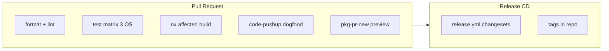

# awesome-pushup-standards

**code-pushup as the guru orchestrating every quality tool.**

Curated plugins and presets for [code-pushup](https://github.com/code-pushup/cli) CLI. code-pushup does not replace quality tools — it orchestrates them into a single scoreboard with audits (0–1), groups, and weighted categories.

## Philosophy

1. **Orchestration, not reinvention** — wrap ruff, ESLint, clippy, Spectral, hadolint, and more.
2. **Presets raise the bar** — `python-backend-strict`, `react-app`, and others ship ready-made weights.
3. **Quality leaps** — heuristic plugins suggest pydantic, Zod, TypeScript adoption.
4. **Non-blocking** — visibility and trends, not arbitrary CI pass/fail gates.

## Domains

Languages (Python, Rust, JS/TS, C++), architecture, API design, React, validation, error handling, code quality, security, Docker, documentation, CI/CD, and optional LLM review.

See [Domains](apps/docs/src/content/docs/reference/domains.md) for implementation status.

## Install

```bash
npm install -D @awesome-pushup-standards/python-backend-strict @code-pushup/cli
```

## Usage

```bash
npx code-pushup collect
```

## Quick start

This repo dogfoods the monorepo CI preset:

```ts
// code-pushup.config.ts
import monorepoCiStrict from '@awesome-pushup-standards/monorepo-ci-strict';

export default await monorepoCiStrict({ rootDir: '.' });
```

Other presets (e.g. Python backend):

```ts
import pythonBackendStrict from '@awesome-pushup-standards/python-backend-strict';

export default await pythonBackendStrict();
```

```bash
npx code-pushup collect
```

## Packages

### Plugins

| Package                 | Description                                   |
| ----------------------- | --------------------------------------------- |
| `python-stack-detector` | Heuristic Python stack checks                 |
| `python-quality`        | ruff, mypy, pytest-cov, bandit, pip-audit     |
| `rust-quality`          | clippy, rustfmt, cargo-audit, tarpaulin       |
| `rust-modules`          | Module cycles, cargo-deny                     |
| `cpp-quality`           | clang-tidy, cppcheck, clang-format            |
| `qt-quality`            | clazy, Qt API checks                          |
| `gtk-style`             | GNOME/GTK style conventions                   |
| `ts-stack-detector`     | TypeScript, Zod, ESLint heuristics            |
| `architecture-rules`    | dependency-cruiser, import-linter, god-module |
| `api-openapi`           | OpenAPI spec, Spectral, versioning            |
| `react-standards`       | React 19, state libs, hooks, forms            |
| `docker-quality`        | hadolint, multi-stage, image scan CI          |
| `error-logging`         | bare except, structured logging               |
| `cicd-quality`          | CI workflows, pinned actions, Nx affected     |
| `contributor-hygiene`   | commitlint, husky, prettier, knip             |
| `release-quality`       | OIDC publish, separated release               |
| `docs-quality`          | README, changelog, license                    |
| `security-sast`         | Secrets, dependency audit, SAST               |
| `llm-review`            | Optional LLM rubric review                    |

### Presets

| Package                 | Description                             |
| ----------------------- | --------------------------------------- |
| `python-backend-strict` | Python backend (full stack)             |
| `react-app`             | React + TS + ESLint + standards         |
| `rust-cli`              | Rust CLI applications                   |
| `cpp-qt-desktop`        | C++/Qt desktop apps                     |
| `gtk-desktop`           | GTK/GNOME desktop apps                  |
| `monorepo-ci-strict`    | Monorepo CI/CD + shift-left (this repo) |

## Testing pyramid

| Layer | Command            | Scope                                     |
| ----- | ------------------ | ----------------------------------------- |
| Unit  | `npm run test:all` | 19 plugins, min. 2 cases each             |
| E2E   | `npm run e2e`      | 19× Docker collect (sequential, ~2–4 min) |

E2E uses a **contract-first** standard: tool preflight → collect → fresh report → good/bad assertions. Commands: `npm run e2e`, `npm run e2e:rebuild`, `npm run e2e:images`. Details: [E2E contract standard](apps/docs/src/content/docs/guides/e2e-testing.md#e2e-contract-standard).
| Smoke | `npm run pushup` | Full `monorepo-ci-strict` preset |

Full walkthrough (all layers): [E2E testing — all 19 plugins](apps/docs/src/content/docs/guides/e2e-testing.md#running-tests-for-all-19-plugins) · [Troubleshooting hangs](apps/docs/src/content/docs/guides/e2e-testing.md#troubleshooting) · local preview: `npm run docs:dev`.

## CI/CD architecture

GitHub Actions follow [code-pushup/cli](https://github.com/code-pushup/cli) patterns:

- **Nx affected** — lint, test, build only changed packages
- **Multi-OS matrix** — ubuntu, windows, macos
- **Fork-safe** — separate `code-pushup-fork.yml` for untrusted PRs
- **Repo versioning** — changesets + tags in GitHub (npm publish disabled)
- **Shift-left** — husky, commitlint, prettier, knip locally

Optional secrets: `NX_CLOUD_ACCESS_TOKEN`, `CODECOV_TOKEN`, `CP_API_KEY`.



Full architecture, audit mapping, and open items: [Backlog](apps/docs/src/content/docs/project/backlog.md) (operational) · [Monorepo CI/CD](apps/docs/src/content/docs/project/monorepo-ci.md) (CI details).

### Open items (backlog)

See **[Backlog](apps/docs/src/content/docs/project/backlog.md)** for Pending, Deferred, and Cancelled items. Quick view:

| Item                                                       | Status        |
| ---------------------------------------------------------- | ------------- |
| E2E Docker verification (19 plugins + CI)                  | **Pending**   |
| GitHub App bot, SHA pinning, Codecov, Nx Release, Nx Cloud | **Deferred**  |
| npm publish                                                | **Cancelled** |

## Getting started for maintainers

1. Clone with submodules: `git clone --recurse-submodules <repo-url>`
2. Install and verify: `npm ci && npm run build && npm test && npm run pushup`
3. First-time publish checklist: [Monorepo CI — publication phase](apps/docs/src/content/docs/project/monorepo-ci.md#faza-publikacji)
4. Optional GitHub secrets: `NX_CLOUD_ACCESS_TOKEN`, `CP_API_KEY`, `CODECOV_TOKEN`
5. Version tags document releases in-repo — npm publish is out of scope
6. Contributors: fork → PR (fork PRs use `code-pushup-fork.yml` without secrets)

## Development

Open / deferred work: **[Backlog](apps/docs/src/content/docs/project/backlog.md)**.

```bash
git submodule update --init --recursive
npm ci
npm run build
npm run test:all
npm run e2e:images
npm run e2e
# first time or after Dockerfile changes:
npm run e2e:rebuild
npm run format
npx nx affected -t lint,test,build --base=main
npm run pushup
```

Reference repos (submodules):

- [code-pushup/cli](https://github.com/code-pushup/cli)
- [code-pushup/community-plugins](https://github.com/code-pushup/community-plugins)

## Documentation

Built with [Starlight](https://starlight.astro.build/). Local preview: `npm run docs:dev` → [http://localhost:4321](http://localhost:4321).

- [Plugin authoring](apps/docs/src/content/docs/guides/plugin-authoring.md)
- [Scoring model](apps/docs/src/content/docs/reference/scoring-model.md)
- [Domains](apps/docs/src/content/docs/reference/domains.md)
- [Backlog / open items](apps/docs/src/content/docs/project/backlog.md)
- [Monorepo CI/CD](apps/docs/src/content/docs/project/monorepo-ci.md)
- [E2E testing](apps/docs/src/content/docs/guides/e2e-testing.md)
- [LLM configuration](apps/docs/src/content/docs/guides/llm-configuration.md)

## Contributing

See [CONTRIBUTING.md](CONTRIBUTING.md).

## License

MIT
