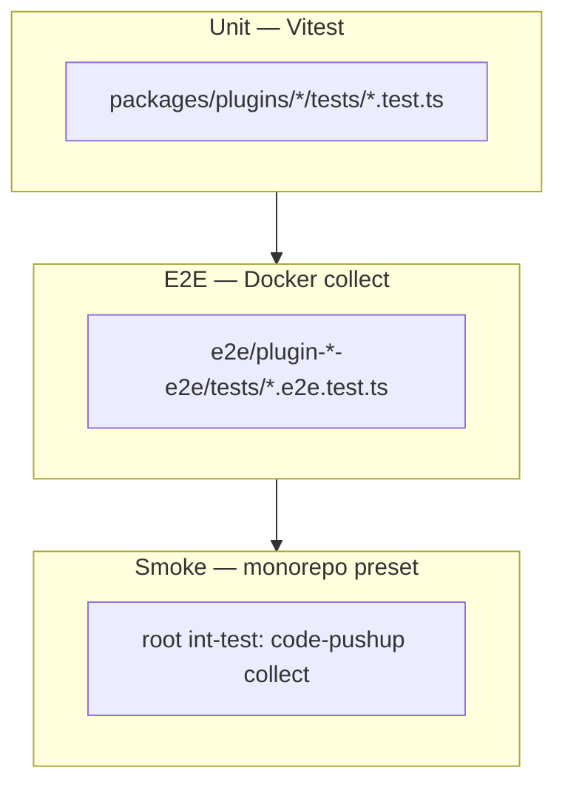

# E2E testing per plugin

Each plugin has an isolated end-to-end project under `e2e/plugin-<slug>-e2e/` that runs `code-pushup collect` against **good** and **bad** fixtures and asserts on host reports under `e2e/plugin-<slug>-e2e/logs/<good|bad>/.code-pushup/report.json`.

## Running tests for all 19 plugins

From the **repository root**:

```bash
npm ci
npm run build
```

Git submodules (`submodules/cli`, `submodules/community-plugins`) are **optional** — reference copies for plugin authors, not required for tests or collect.

### Full test suite (unit + E2E + smoke)

Run all three layers of the pyramid in order:

```bash
# 1. Unit tests — every plugin under packages/plugins/* (min. 2 cases each)
npm run test:all

# 2. E2E — 19 plugins × good/bad = 38 collects + logs (sequential)
npm run e2e:all            # build images + run (first time)
# or:
npm run e2e:build-images   # images only
npm run e2e                # runs scripts/run-e2e.mjs — logs under e2e/plugin-*-e2e/logs/

# 3. Smoke — full monorepo preset (all plugins together)
npm run pushup
# equivalent: npx nx run awesome-pushup-standards:int-test
```

Expected E2E result: **Test Files 19 passed · Tests 38 passed**.

### E2E only (all plugins)

When unit tests and build already succeeded:

```bash
npm run e2e:build-images
npm run e2e
# one-shot (images + tests + logs):
npm run e2e:all
```

`npm run e2e` calls [`scripts/run-e2e.mjs`](https://github.com/kacperpaczos/Awesome-Pushup-Standards/blob/main/scripts/run-e2e.mjs) — sequential Vitest, `E2E_COLLECT_LOG=1`, summary of log paths at the end.

Single plugin:

```bash
node scripts/run-e2e.mjs python-quality
# or with explicit "keep reports" compatibility flag (reports stay in logs/):
node scripts/run-e2e.mjs --keep-reports python-quality
```

Alternative via Nx (Vitest directly — logs still enabled via `vitest.e2e.config.ts` globalSetup):

```bash
npx nx run-many -t e2e --parallel=1
```

### Keep code-pushup reports on disk

By default, `npm run e2e` keeps canonical reports under `logs/` and cleans fixture `.code-pushup/` directories. To run with the compatibility flag:

```bash
npm run e2e:keep-reports
```

Canonical reports are written to:

```
e2e/plugin-<slug>-e2e/logs/good/.code-pushup/report.json
e2e/plugin-<slug>-e2e/logs/bad/.code-pushup/report.json
```

`E2E_KEEP_REPORTS=1` is preserved for backward compatibility, but fixture reports are no longer the source of truth.

### Single plugin

Run one plugin's E2E project (good + bad):

```bash
npx vitest run e2e/plugin-python-quality-e2e/tests/collect.e2e.test.ts --config vitest.e2e.config.ts --maxWorkers=1
```

Replace `python-quality` with any plugin slug. To collect and keep the report without Vitest:

```bash
REPO="$(pwd)"
FIXTURE="$REPO/e2e/plugin-python-quality-e2e/mocks/fixtures/good"

docker run --rm \
  -v "$REPO:$REPO" \
  -w "$FIXTURE" \
  --network host \
  e2e-python:3.12 \
  bash -lc "git config --global --add safe.directory $REPO && npx code-pushup collect --config code-pushup.config.ts"
```

Use the Docker image from the [plugin → image table](#docker-images) below (`e2e-node:20` for Node plugins, etc.).

### Without Docker

Only Node/heuristic plugins produce meaningful reports on the host:

```bash
E2E_USE_DOCKER=0 npm run e2e
```

Python, Rust, C++/Qt, GTK, and security plugins require Docker images.

## Test pyramid



| Layer | Command                                        | Scope                            |
| ----- | ---------------------------------------------- | -------------------------------- |
| Unit  | `npm run test:all`                             | 19 plugins, runner logic         |
| E2E   | `npm run e2e`                                  | 19× good/bad fixture collect     |
| Smoke | `npx nx run awesome-pushup-standards:int-test` | Full `monorepo-ci-strict` preset |

## Prerequisites

- Docker (recommended for CI parity)
- `npm ci && npm run build` at repo root

E2E runs **sequentially** (`maxWorkers: 1`) — one Docker collect at a time. Do not raise Vitest parallelism; parallel `docker run` calls contend on the shared repo mount and `node_modules`.

## Local commands

Quick reference (see [Running tests for all 19 plugins](#running-tests-for-all-19-plugins) above for the full walkthrough):

Quick reference — all via [`scripts/run-e2e.mjs`](https://github.com/kacperpaczos/Awesome-Pushup-Standards/blob/main/scripts/run-e2e.mjs):

```bash
npm run e2e                  # all plugins + logs
npm run e2e:all              # build images + e2e + logs
npm run e2e:keep-reports     # compatibility alias; canonical reports still in logs/
npm run e2e:build-images     # Docker images only

node scripts/run-e2e.mjs --build-images docs-quality   # one plugin
```

## Collect logs (stdout + report per container)

Logs are written **on the host** (your user, `644` files / `755` dirs) — not as root inside Docker. On Linux, containers run with `--user $(id -u):$(id -g)` and reports are persisted directly to `logs/<variant>/.code-pushup/`.

### Per test project (recommended)

Each collect copies output into the E2E project tree:

```text
e2e/plugin-<slug>-e2e/logs/good/
├── collect.log      # full section: command, stdout, stderr, report summary
├── stdout.log       # container stdout only
├── stderr.log       # container stderr only
├── report.json      # code-pushup report (host copy)
├── report.md        # if generated
├── meta.json        # image, exit code, duration, artifact paths
└── artifacts/       # copy of persisted outputs from logs/<variant>/.code-pushup/*

e2e/plugin-<slug>-e2e/logs/bad/
└── … same layout
```

Example:

```bash
cat e2e/plugin-python-quality-e2e/logs/good/stdout.log
cat e2e/plugin-python-quality-e2e/logs/good/report.json
ls e2e/plugin-python-quality-e2e/logs/good/artifacts/
```

### Combined log (all 38 collects)

```text
e2e/logs/latest.log
e2e/logs/index.json
```

Vitest prints the path at startup: `E2E collect log → …/e2e/logs/latest.log`.

Each section includes fixture path, Docker image, command, stdout/stderr, audit summary, and full `report.json`.

```bash
grep -A30 'plugin-python-quality-e2e/mocks/fixtures/good' e2e/logs/latest.log
jq '.entries[] | select(.plugin=="python-quality" and .variant=="good")' e2e/logs/index.json
```

Audit slugs map to tools (e.g. `ruff-lint` → ruff). Full tool chains: `packages/plugins/<slug>/README.md`.

Log directories are gitignored (`e2e/**/logs/**`). Disable logging with `E2E_COLLECT_LOG=0`.

## Troubleshooting

### Tests hang on „bad fixture fails expected audit”

**Symptom:** Vitest shows many plugins running at once; several `docker run` lines spin; you need `Ctrl+C`.

**Cause:** Parallel E2E collects mount the same repo and run `npx code-pushup` against shared `node_modules` — Docker and npm lock up.

**Fix:** Always use the repo scripts (they force `--maxWorkers=1`):

```bash
npm run e2e
# not: vitest run --config vitest.e2e.config.ts   # may parallelize
```

During a run, `docker ps` should show **at most one** `e2e-*` container.

### After interrupting a run

```bash
docker ps          # check for leftover containers
docker container prune -f   # if needed
```

Then re-run `npm run e2e`.

### Expected duration

Full suite: **~2–4 minutes** sequentially (38 collects). „Bad” fixtures (Python, Rust, C++) take longer than „good” — that is normal, not a hang.

### Optional reference submodules

Only needed when browsing official plugin examples locally:

```bash
git submodule update --init --recursive
```

See [CONTRIBUTING.md](https://github.com/kacperpaczos/Awesome-Pushup-Standards/blob/main/CONTRIBUTING.md) for paths under `submodules/`.

## Docker images

| Image             | Plugins                                                                                                         |
| ----------------- | --------------------------------------------------------------------------------------------------------------- |
| `e2e-node:20`     | docs, cicd, contributor, release, ts-stack, react, docker, architecture, api-openapi, error-logging, llm-review |
| `e2e-python:3.12` | python-stack-detector, python-quality                                                                           |
| `e2e-rust:1.83`   | rust-quality, rust-modules                                                                                      |
| `e2e-cpp:qt`      | cpp-quality, qt-quality                                                                                         |
| `e2e-gtk:c`       | gtk-style                                                                                                       |
| `e2e-security`    | security-sast                                                                                                   |

Images are defined in `docker/e2e/*/Dockerfile` and orchestrated by `docker-compose.e2e.yml`.

## Project layout (per plugin)

```
e2e/plugin-<slug>-e2e/
├── project.json
├── vitest.e2e.config.ts
├── mocks/fixtures/
│   ├── good/                 # expected audits ≥ 0.9 (non-skipped)
│   │   ├── code-pushup.config.ts
│   │   └── … minimal project files
│   └── bad/                  # known violation → target audit score 0
└── tests/collect.e2e.test.ts
```

Fixtures import **one** plugin from `@awesome-pushup-standards/<slug>` via `code-pushup.config.ts`.

## Shared helpers

`testing/e2e-utils/` provides:

- `runCollectInContainer({ fixtureRelPath, image })` — Docker collect; writes `e2e/plugin-*-e2e/logs/<good|bad>/` + `e2e/logs/latest.log`
- `cleanupE2eFixtureReports(fixtureRelPath)` — always cleans fixture `.code-pushup/` (reports are canonical in logs/)
- `readReport`, `assertAudits`, `assertAllAuditsMinScore`
- `isDockerAvailable`, `E2E_IMAGES`

## Plugin → image map

See `scripts/scaffold-e2e.mjs` for the canonical mapping and fixture definitions. Regenerate projects after changing the manifest:

```bash
node scripts/scaffold-e2e.mjs
```

## CI

GitHub Actions job `e2e` in `.github/workflows/ci.yml` runs `npm run e2e:all` and uploads `e2e/logs/latest.log`, `e2e/logs/index.json`, and `e2e/plugin-*-e2e/logs/**` as artifacts.

## Verification checklist

Status operacyjny: **[backlog.md#pending--najbliższe-kroki](/project/backlog/#pending--najbliższe-kroki)**.

| Step                                 | Command / action                     | Status                          |
| ------------------------------------ | ------------------------------------ | ------------------------------- |
| Build Docker images                  | `npm run e2e:build-images`           | **Done** (obrazy zbudowane)     |
| Run all plugin E2E locally           | `npm run e2e` (38 tests, 19 plugins) | **Done** (38/38 passed, Docker) |
| CI job `e2e` green on GitHub Actions | push to `main` / PR                  | **Pending**                     |

After all three pass, update [backlog.md](/project/backlog/): move E2E verification from Pending to Done.

## Adding a new plugin

1. Implement plugin under `packages/plugins/<slug>/` with unit tests (min. 2 cases).
2. Add entry to `scripts/scaffold-e2e.mjs` and run `node scripts/scaffold-e2e.mjs`.
3. Verify locally: `npm run e2e:build-images && npx vitest run e2e/plugin-<slug>-e2e/tests/collect.e2e.test.ts --config vitest.e2e.config.ts --maxWorkers=1`.

See [CONTRIBUTING.md](https://github.com/kacperpaczos/Awesome-Pushup-Standards/blob/main/CONTRIBUTING.md).
