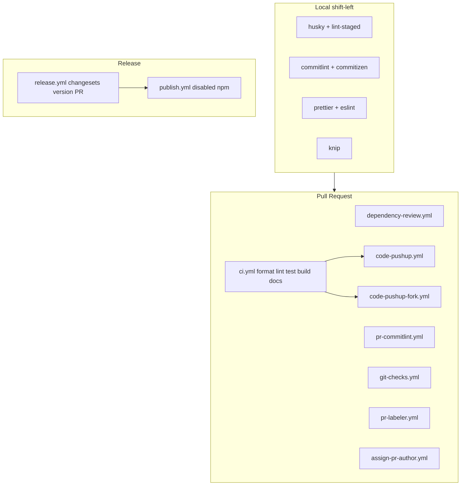
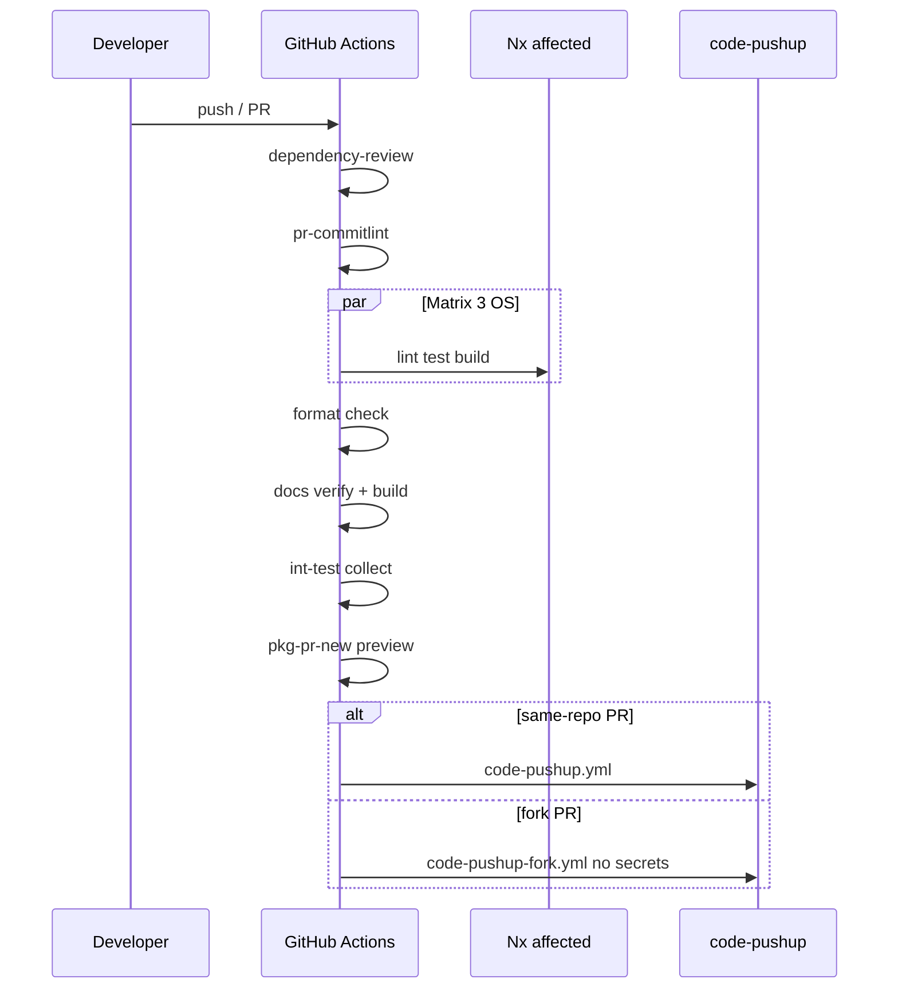
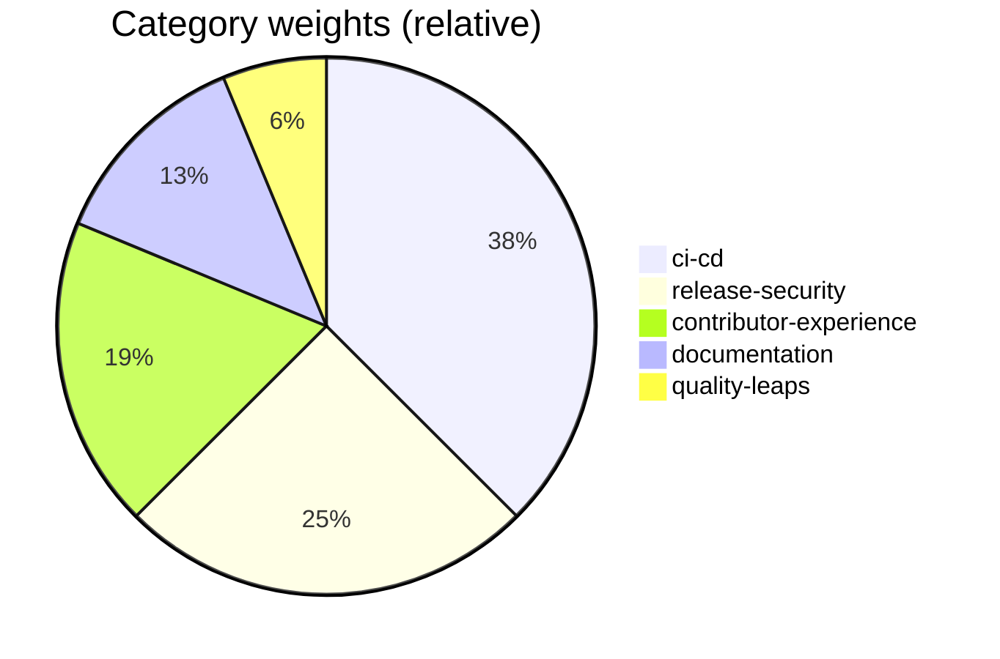
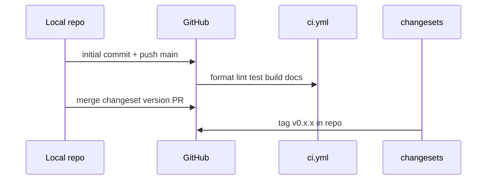
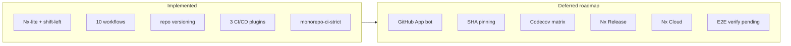

# Monorepo CI/CD

This document maps practices from [code-pushup/cli](https://github.com/code-pushup/cli) to audits in the `monorepo-ci-strict` preset.

## Architecture (current)



## PR CI flow



## Workflow → audit mapping

| Workflow                                  | Purpose                                                           | Audits                                               |
| ----------------------------------------- | ----------------------------------------------------------------- | ---------------------------------------------------- |
| `ci.yml`                                  | format, lint, unit (3 OS), build, docs, int-test, e2e, pkg-pr-new | `multi-os-ci`, `nx-affected-ci`, `pkg-preview-on-pr` |
| `code-pushup.yml`                         | Dogfooding on same-repo PRs                                       | —                                                    |
| `code-pushup-fork.yml`                    | Fork PR via `pull_request_target`, no secrets                     | `fork-safe-workflows`                                |
| `dependency-review.yml`                   | Scan new dependencies on PR                                       | `dependency-review-workflow`                         |
| `release.yml`                             | Changesets — versioning PR                                        | `separated-release-publish`, `release-environment`   |
| `publish.yml`                             | Disabled — npm publish out of scope                               | —                                                    |
| `pr-commitlint.yml`                       | Conventional PR titles                                            | `pr-commitlint`                                      |
| `git-checks.yml`                          | Block `fixup!` commits                                            | —                                                    |
| `pr-labeler.yml` / `assign-pr-author.yml` | PR automation                                                     | —                                                    |

## Shift-left (local)

| File                                                             | Audit                   |
| ---------------------------------------------------------------- | ----------------------- |
| `commitlint.config.js` + `.husky/commit-msg`                     | `conventional-commits`  |
| `.husky/pre-commit`                                              | `pre-commit-hooks`      |
| `npm run commit` + commitizen config                             | `commitizen-configured` |
| `.editorconfig`, `.prettierrc`, `knip.config.ts`, `.env.example` | contributor-hygiene     |

## Nx affected

CI uses `nrwl/nx-set-shas@v4` and `npx nx affected -t lint,test,build`.

Locally:

```bash
npx nx affected -t lint,test,build --base=main
```

Submodules (`submodules/`) are excluded from the Nx graph via `.nxignore`.

## Secrets

| Secret                  | Required | Purpose                           |
| ----------------------- | -------- | --------------------------------- |
| `NX_CLOUD_ACCESS_TOKEN` | Optional | Nx Cloud remote cache             |
| `CODECOV_TOKEN`         | Optional | Coverage upload (see deferred §3) |
| `CP_API_KEY`            | Optional | code-pushup report upload         |

npm package publish is **out of scope** (no Trusted Publisher / OIDC). Versions `0.1.0+` and changelogs live in the repo; `publish.yml` stays disabled (`if: false`).

## `monorepo-ci-strict` categories



| Category                   | Audits (summary)                                        |
| -------------------------- | ------------------------------------------------------- |
| **ci-cd**                  | workflows, pinning, multi-OS, Nx, dependency review     |
| **release-security**       | OIDC, separated release/publish, fork-safe, permissions |
| **contributor-experience** | commitlint, husky, commitizen                           |
| **documentation**          | README, SECURITY.md, CONTRIBUTING                       |
| **quality-leaps**          | knip, pkg-pr-new, release environment (aspirational)    |

---

## Publication phase

Operational checklist for maintainers — from local repo to GitHub versioning (no npm publish).

### Flow



### Checklist

| Step | Action                                                  | Status                                                                  |
| ---- | ------------------------------------------------------- | ----------------------------------------------------------------------- |
| 1    | Extend `.gitignore` (`.nx/`, `.pytest_cache/`, …)       | Done                                                                    |
| 2    | `npm ci && npm run build && npm test && npm run pushup` | Done locally                                                            |
| 3    | Changeset initial release in `.changeset/`              | Done                                                                    |
| 4    | `git commit` + `git push -u origin main`                | Done — [repo](https://github.com/kacperpaczos/Awesome-Pushup-Standards) |
| 5    | GitHub → Environments → create **`release`**            | Done (API)                                                              |
| 5b   | Actions → allow workflows to create PRs                 | Done (API)                                                              |
| 6    | npmjs.com → Trusted Publisher (repo + `publish.yml`)    | **Cancelled / out of scope** — repo-only publish, no npm                |
| 7    | Optional: `NX_CLOUD_ACCESS_TOKEN`, `CP_API_KEY`         | Manual                                                                  |
| 8    | Branch protection on `main` (after green CI)            | Manual                                                                  |

### npm publish (out of scope)

Publishing `@awesome-pushup-standards/*` to npm is **not planned** — no Trusted Publisher / OIDC. `publish.yml` is disabled. Versioning happens in the repository (changesets, `v*.*.*` tags, per-package CHANGELOG).

### Post-push verification

1. **Actions** — `ci.yml` jobs green (ubuntu; windows/macos may surface edge cases).
2. **Test PR** — `dependency-review`, `pr-commitlint`, code-pushup comment.
3. Merge **Version Packages** PR (from `release.yml`).
4. Tag `v*.*.*` documents the release — no npm publish.

### Note: `nx affected`

`npx nx affected -t lint,test,build --base=main` requires **commit history on `main`**. Before the first local commit, use `npx nx run-many -t lint,test,build`.

---

## Deferred roadmap

**Full open and deferred list:** [backlog.md](/project/backlog/).

The items below are **consciously deferred**. They do not block current CI; treat them as roadmap for future PRs.

### 1. GitHub App release bot

|               |                                                                                                                |
| ------------- | -------------------------------------------------------------------------------------------------------------- |
| **Status**    | Deferred (release phase 2)                                                                                     |
| **Problem**   | `changesets/action` commits as `github-actions[bot]` — harder branch protection / signed commits               |
| **Proposal**  | GitHub App bot (`GH_APP_ID`, `GH_APP_PRIVATE_KEY`) instead of default `GITHUB_TOKEN`                           |
| **Requires**  | Org/repo App setup, permissions, secrets in `release` environment                                              |
| **Reference** | [code-pushup/cli release workflow](https://github.com/code-pushup/cli/blob/main/.github/workflows/release.yml) |

### 2. Full SHA pinning

|              |                                                                                                                             |
| ------------ | --------------------------------------------------------------------------------------------------------------------------- |
| **Status**   | Deferred                                                                                                                    |
| **Current**  | Actions use version tags (`@v4`); `actions-pinned` audit accepts tags and local composite actions (`./.github/actions/...`) |
| **Target**   | All `uses:` reference full commit SHA (supply chain hardening)                                                              |
| **Requires** | Pin update script + CONTRIBUTING process (e.g. Dependabot for Actions)                                                      |
| **Note**     | Local composite actions have no SHA — excluded from audit                                                                   |

### 3. Codecov matrix coverage

|               |                                                                                                             |
| ------------- | ----------------------------------------------------------------------------------------------------------- |
| **Status**    | Deferred (phase 2)                                                                                          |
| **Current**   | No `vitest --coverage` in packages; no `coverage.yml` workflow                                              |
| **Target**    | Codecov job per package, `CODECOV_TOKEN` secret, README badge                                               |
| **Reference** | [code-pushup/cli coverage.yml](https://github.com/code-pushup/cli/blob/main/.github/workflows/coverage.yml) |
| **Requires**  | `@vitest/coverage-v8` in packages, Nx `coverage` target, separate workflow                                  |

### 4. Nx Release instead of Changesets

|              |                                                                                                   |
| ------------ | ------------------------------------------------------------------------------------------------- |
| **Status**   | Deferred — separate migration                                                                     |
| **Current**  | Changesets: `release.yml` (version PR) + `publish.yml` (tag OIDC)                                 |
| **Target**   | `nx release` with conventional commits as single version source                                   |
| **Requires** | Stable conventional commits (already local), changelog migration, `release-quality` audit updates |
| **When**     | After several Changesets releases with consistent commit history                                  |

### 5. Nx Cloud optional cache

|              |                                                                                              |
| ------------ | -------------------------------------------------------------------------------------------- |
| **Status**   | Optional — enabled when secret exists                                                        |
| **Benefit**  | Faster `nx affected` in CI via distributed cache                                             |
| **Requires** | `NX_CLOUD_ACCESS_TOKEN` in repo secrets; audit weight **0** in scoring model (informational) |

### 6. E2E in Nx test pyramid

|               |                                                                                                                        |
| ------------- | ---------------------------------------------------------------------------------------------------------------------- |
| **Status**    | **Pending verification** — implementation Done; local + CI verification Pending — [backlog](/project/backlog/#pending) |
| **Current**   | 19× `e2e/plugin-*-e2e`, Nx `e2e` target, `e2e` job in `ci.yml`                                                         |
| **Pyramid**   | unit (Vitest) → e2e per plugin (Docker collect) → `int-test` monorepo smoke                                            |
| **Reference** | `e2e/*-e2e` in submodules/cli · [e2e-testing.md](/guides/e2e-testing/)                                                 |

### Roadmap (current → target)



### Prioritization (suggested)

| Priority | Item              | Effort | Impact              |
| -------- | ----------------- | ------ | ------------------- |
| **P1**   | E2E Docker verify | Low    | Close Phase 7       |
| P2       | SHA pinning       | Medium | Supply chain        |
| P2       | Codecov matrix    | Medium | Coverage visibility |
| P3       | GitHub App bot    | High   | Release hygiene     |
| P3       | Nx Cloud          | Low    | CI speed            |
| P4       | Nx Release        | High   | Simplify CD         |
