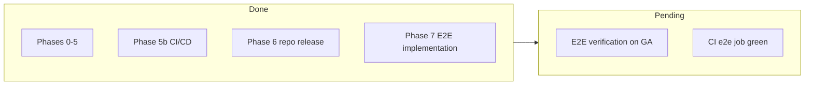

# Project vision

**awesome-pushup-standards** is a curated collection of [code-pushup](https://github.com/code-pushup/cli) plugins and presets. code-pushup **orchestrates** existing quality tools (ESLint, ruff, clippy, Spectral, hadolint, trivy, …) into one scoreboard with audits (0–1), groups, and weighted categories.

Operational backlog: [Backlog](/project/backlog/). Getting started: [guides/getting-started](/guides/getting-started/).

## Philosophy

code-pushup does not replace quality tools — it **orchestrates** them. Each tool produces results; code-pushup maps them to audits, groups them, and aggregates categories with weights so teams see one trend instead of many CI reports.

Three pillars:

1. **Orchestration (guru).** Wrap best-in-class tools in a unified audit model; do not invent new analyzers.
2. **Presets raise the bar.** Profiles like `python-backend-strict` ship plugins, categories, and weights without hand-tuning.
3. **Quality leaps.** Heuristic plugins detect missing practices (pydantic, Zod, TypeScript) and suggest adoption instead of only punishing existing defects.

code-pushup is **non-blocking by design** — visibility and trends, not arbitrary CI pass/fail gates. See [Scoring model](/reference/scoring-model/).

## Domains (not only languages)

| Domain                   | Examples                                         |
| ------------------------ | ------------------------------------------------ |
| Languages                | Python, Rust, JS/TS, C++, GTK, Qt                |
| Architecture             | dependency-cruiser, import-linter, cargo-modules |
| API design               | OpenAPI presence, Spectral, versioning           |
| React                    | version, hooks, a11y, bundle size                |
| Quality leaps            | pydantic, Zod, TypeScript adoption               |
| Error handling & logging | bare except, structured logging                  |
| Security                 | SAST, dependency audit, secrets, SBOM            |
| Docker                   | hadolint, image scan, multi-stage                |
| Documentation            | README, changelog, license, contributing         |
| CI/CD                    | workflows, pinned actions, release hygiene       |
| LLM (optional)           | rubric-based `llm-review`                        |

Full implementation status: [Domains](/reference/domains/) and [Plugins catalog](/reference/plugins-catalog/).

## Plugin types

### Heuristic / static

Read project files and configs. Binary scores (1 = practice present, 0 = missing) with `displayValue` hints and optional `warning` issues. Examples: `python-stack-detector`, `ts-stack-detector`, `docs-quality`, `cicd-quality`.

### Wrapper

Shell out to external CLIs (`ruff`, `cargo clippy`, `spectral`, `hadolint`, …). Map tool output to audits. Missing CLI behavior is defined by [Audit contracts](/reference/audit-contracts/) (`rigor: base | strict`).

### LLM (optional)

Active only when `PUSHUP_LLM_ENDPOINT` (and related env vars) are set. Rubric dimensions scored 0–5, normalized to 0–1 with structured JSON output. **Graceful skip** when not configured — see [LLM configuration](/guides/llm-configuration/).

## Presets

Presets bundle plugins and weighted categories. Six published presets:

- `python-backend-strict`, `react-app`, `rust-cli`, `cpp-qt-desktop`, `gtk-desktop`, `monorepo-ci-strict`

Breaking changes to category weights require a **major** version bump (changeset). Details per preset in sidebar **Presets** or [Documentation registry](/reference/documentation-registry/).

## Versioning & contribution

- npm workspaces monorepo; packages scoped `@awesome-pushup-standards/*`
- **Changesets** for semver releases
- Optional read-only submodules: `submodules/cli`, `submodules/community-plugins` (reference for plugin authors)
- Quality bar: [Contributing](/guides/contributing/)

## Roadmap phases

| Phase | Scope                                                                         | Status                               |
| ----- | ----------------------------------------------------------------------------- | ------------------------------------ |
| 0–5   | Foundation, MVP languages, Rust, C++/Qt/GTK, cross-domain plugins, LLM plugin | Done                                 |
| 5b    | Monorepo CI/CD, `monorepo-ci-strict`, shift-left hooks                        | Done                                 |
| 6     | Repo versioning `0.1.0`, release workflow (npm publish deferred)              | Done                                 |
| 7     | 19× E2E plugin projects, Docker collect, CI `e2e` job                         | Implemented; GA verification pending |

Pending items: [Backlog — Pending](/project/backlog/#pending). Deferred roadmap: [Monorepo CI — deferred roadmap](/project/monorepo-ci/#deferred-roadmap).
