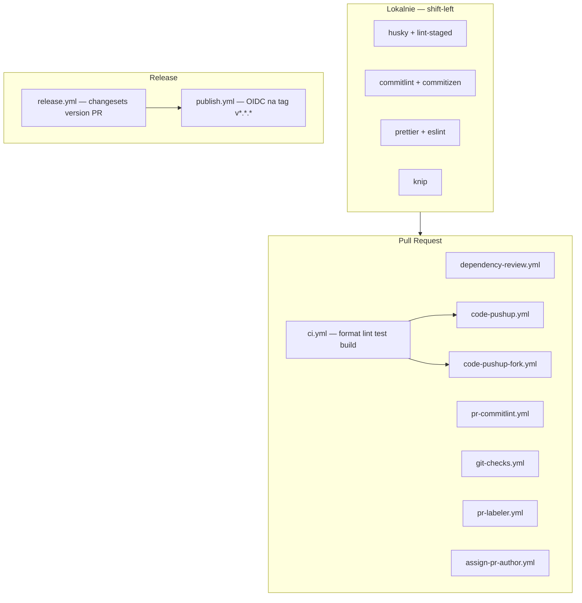
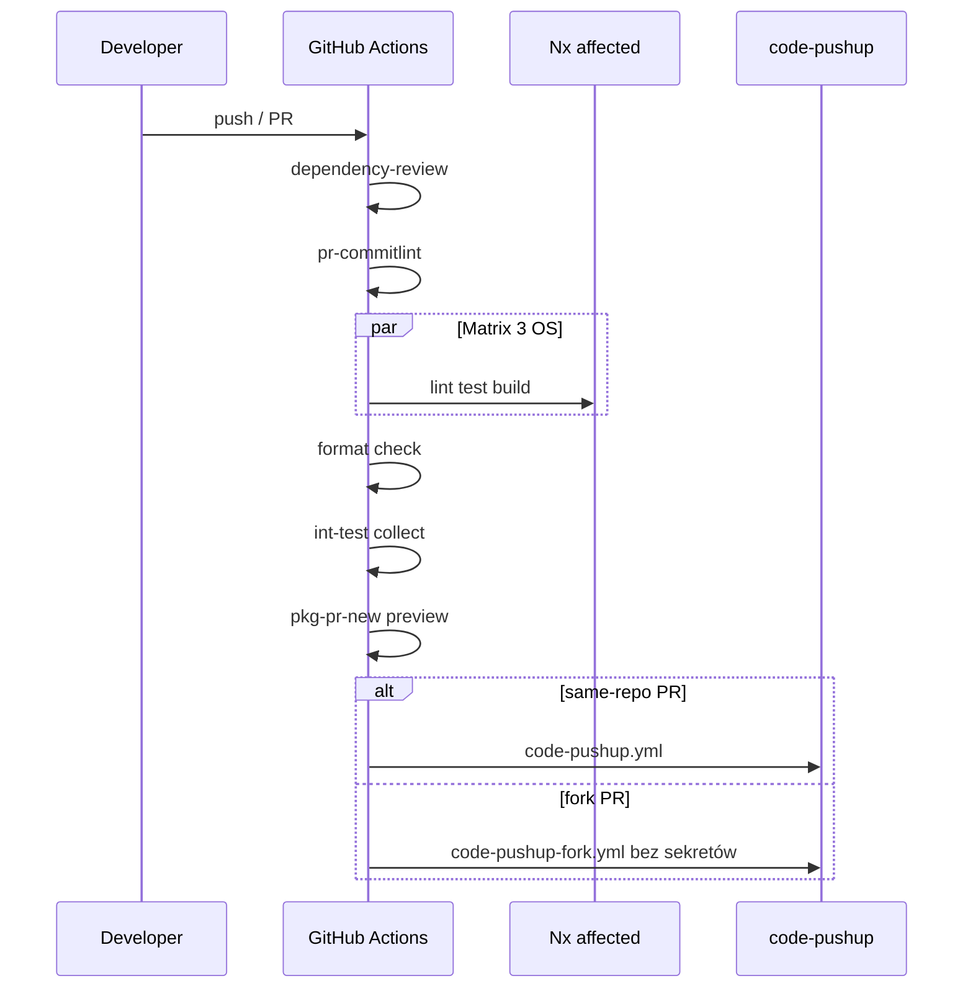
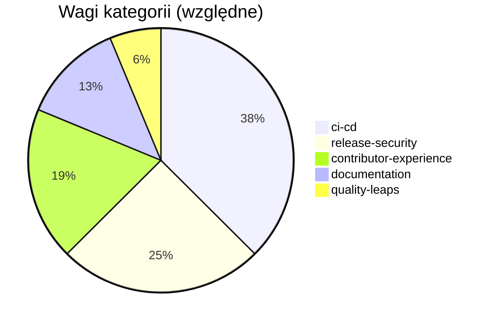
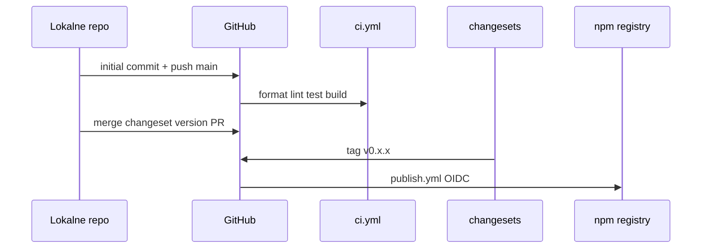
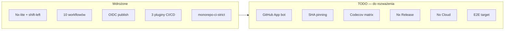

# Monorepo CI/CD

Ten dokument mapuje praktyki z [code-pushup/cli](https://github.com/code-pushup/cli) na audyty presetu `monorepo-ci-strict`.

## Architektura (stan obecny)



## Przepływ CI na PR



## Mapowanie workflow → audyty

| Workflow                                  | Cel                                                    | Audyty                                               |
| ----------------------------------------- | ------------------------------------------------------ | ---------------------------------------------------- |
| `ci.yml`                                  | format, lint, unit (3 OS), build, int-test, pkg-pr-new | `multi-os-ci`, `nx-affected-ci`, `pkg-preview-on-pr` |
| `code-pushup.yml`                         | Dogfooding na PR z tego samego repo                    | —                                                    |
| `code-pushup-fork.yml`                    | Fork PR przez `pull_request_target`, bez sekretów      | `fork-safe-workflows`                                |
| `dependency-review.yml`                   | Skan nowych zależności na PR                           | `dependency-review-workflow`                         |
| `release.yml`                             | Changesets — PR wersjonujący                           | `separated-release-publish`, `release-environment`   |
| `publish.yml`                             | OIDC publish na tag `v*.*.*`                           | `npm-oidc-publish`, `release-concurrency`            |
| `pr-commitlint.yml`                       | Conventional PR titles                                 | `pr-commitlint`                                      |
| `git-checks.yml`                          | Blokada commitów `fixup!`                              | —                                                    |
| `pr-labeler.yml` / `assign-pr-author.yml` | Automatyzacja PR                                       | —                                                    |

## Shift-left (lokalnie)

| Plik                                                             | Audyt                   |
| ---------------------------------------------------------------- | ----------------------- |
| `commitlint.config.js` + `.husky/commit-msg`                     | `conventional-commits`  |
| `.husky/pre-commit`                                              | `pre-commit-hooks`      |
| `npm run commit` + commitizen config                             | `commitizen-configured` |
| `.editorconfig`, `.prettierrc`, `knip.config.ts`, `.env.example` | contributor-hygiene     |

## Nx affected

CI używa `nrwl/nx-set-shas@v4` i `npx nx affected -t lint,test,build`.

Lokalnie:

```bash
npx nx affected -t lint,test,build --base=main
```

Submoduły (`submodules/`) są wykluczone z grafu Nx przez `.nxignore`.

## Sekrety

| Secret                  | Wymagany | Cel                                  |
| ----------------------- | -------- | ------------------------------------ |
| `NX_CLOUD_ACCESS_TOKEN` | Opcjonal | Nx Cloud — zdalny cache              |
| `CODECOV_TOKEN`         | Opcjonal | Upload coverage (patrz TODO poniżej) |
| `CP_API_KEY`            | Opcjonal | Upload raportów code-pushup          |

Publikacja npm używa **OIDC trusted publishing** — bez długowiecznego `NPM_TOKEN`.

## Kategorie presetu `monorepo-ci-strict`



| Kategoria                  | Audyty (skrót)                                          |
| -------------------------- | ------------------------------------------------------- |
| **ci-cd**                  | workflows, pinning, multi-OS, Nx, dependency review     |
| **release-security**       | OIDC, separated release/publish, fork-safe, permissions |
| **contributor-experience** | commitlint, husky, commitizen                           |
| **documentation**          | README, SECURITY.md, CONTRIBUTING                       |
| **quality-leaps**          | knip, pkg-pr-new, release environment (aspiracyjne)     |

---

## Faza publikacji

Checklist operacyjna dla maintainers — od lokalnego repo do paczek na npm.

### Przepływ



### Checklist

| Krok | Akcja                                                   | Status        |
| ---- | ------------------------------------------------------- | ------------- |
| 1    | Rozszerzyć `.gitignore` (`.nx/`, `.pytest_cache/`)      | Done          |
| 2    | `npm ci && npm run build && npm test && npm run pushup` | Done lokalnie |
| 3    | Changeset initial release w `.changeset/`               | Done          |
| 4    | `git commit` + `git push -u origin main`                | Po pushu      |
| 5    | GitHub → Environments → utworzyć **`release`**          | Ręcznie       |
| 6    | npmjs.com → Trusted Publisher (repo + `publish.yml`)    | Ręcznie       |
| 7    | Opcjonalnie: `NX_CLOUD_ACCESS_TOKEN`, `CP_API_KEY`      | Ręcznie       |
| 8    | Branch protection na `main` (po zielonym CI)            | Ręcznie       |

### npm OIDC (wymagane do publish)

1. Zaloguj się na [npmjs.com](https://www.npmjs.com) → **Access Tokens** → **Trusted Publishers**.
2. Dodaj GitHub Actions: organization/user, repository, workflow file `publish.yml`, environment `release`.
3. W GitHub: **Settings → Environments → release** — bez wymaganych sekretów (OIDC zastępuje `NPM_TOKEN`).

### Po pushu — weryfikacja

1. **Actions** — joby `ci.yml` zielone (ubuntu; windows/macos mogą ujawnić edge case'y).
2. **Test PR** — `dependency-review`, `pr-commitlint`, komentarz code-pushup.
3. Merge **Version Packages** PR (generowany przez `release.yml`).
4. Tag `v*.*.*` uruchamia `publish.yml` → paczki `@awesome-pushup-standards/*` na npm.

### Uwaga: `nx affected`

Komenda `npx nx affected -t lint,test,build --base=main` wymaga **historii commitów na gałęzi `main`**. Przed pierwszym commitem użyj `npx nx run-many -t lint,test,build`.

---

## TODO — do rozważenia

Poniższe elementy są **świadomie odroczone**. Nie blokują obecnego CI; traktuj je jako roadmapę do dyskusji i kolejnych PR-ów.

### 1. GitHub App bot dla release commitów

|                |                                                                                                                          |
| -------------- | ------------------------------------------------------------------------------------------------------------------------ |
| **Status**     | Odroczone (faza 2 release)                                                                                               |
| **Problem**    | Commity z `changesets/action` idą jako `github-actions[bot]` — trudniejsze wymuszanie branch protection / signed commits |
| **Propozycja** | Bot oparty na GitHub App (`GH_APP_ID`, `GH_APP_PRIVATE_KEY`) zamiast domyślnego `GITHUB_TOKEN`                           |
| **Wymaga**     | Konfiguracja org/repo, uprawnienia App, sekrety w environment `release`                                                  |
| **Wzorzec**    | [code-pushup/cli release workflow](https://github.com/code-pushup/cli/blob/main/.github/workflows/release.yml)           |

### 2. Pełne pinowanie SHA akcji GitHub

|                 |                                                                                                                                 |
| --------------- | ------------------------------------------------------------------------------------------------------------------------------- |
| **Status**      | Odroczone                                                                                                                       |
| **Stan obecny** | Akcje używają tagów wersji (`@v4`); audyt `actions-pinned` akceptuje tagi i lokalne composite actions (`./.github/actions/...`) |
| **Docelowo**    | Wszystkie `uses:` wskazują pełny commit SHA (supply chain hardening)                                                            |
| **Wymaga**      | Skrypt aktualizacji pinów + proces w CONTRIBUTING (np. comenda lub Dependabot dla Actions)                                      |
| **Uwaga**       | Lokalne composite actions nie mają SHA — wykluczone z audytu                                                                    |

### 3. Codecov — matrix coverage per pakiet

|                 |                                                                                                             |
| --------------- | ----------------------------------------------------------------------------------------------------------- |
| **Status**      | Odroczone (faza 2)                                                                                          |
| **Stan obecny** | Brak `vitest --coverage` w pakietach; brak workflow `coverage.yml`                                          |
| **Docelowo**    | Job Codecov per pakiet, secret `CODECOV_TOKEN`, badge w README                                              |
| **Wzorzec**     | [code-pushup/cli coverage.yml](https://github.com/code-pushup/cli/blob/main/.github/workflows/coverage.yml) |
| **Wymaga**      | `@vitest/coverage-v8` w pakietach, target Nx `coverage`, osobny workflow                                    |

### 4. Nx Release zamiast Changesets

|                 |                                                                                                                     |
| --------------- | ------------------------------------------------------------------------------------------------------------------- |
| **Status**      | Odroczone — osobna migracja                                                                                         |
| **Stan obecny** | Changesets: `release.yml` (version PR) + `publish.yml` (tag OIDC)                                                   |
| **Docelowo**    | `nx release` z conventional commits jako single source of truth wersji                                              |
| **Wymaga**      | Stabilne conventional commits (już wdrożone lokalnie), migracja changelogów, aktualizacja audytów `release-quality` |
| **Kiedy**       | Po kilku release'ach na Changesets, gdy commit history będzie spójna                                                |

### 5. Nx Cloud (opcjonalny cache)

|             |                                                                                           |
| ----------- | ----------------------------------------------------------------------------------------- |
| **Status**  | Opcjonalny — włącza się gdy istnieje secret                                               |
| **Korzyść** | Szybsze `nx affected` w CI przez distributed cache                                        |
| **Wymaga**  | `NX_CLOUD_ACCESS_TOKEN` w repo secrets; audyt z wagą **0** w scoring model (informacyjny) |

### 6. E2E w piramidzie testów Nx

|                 |                                                                                |
| --------------- | ------------------------------------------------------------------------------ |
| **Status**      | Placeholder                                                                    |
| **Stan obecny** | `int-test` = `code-pushup collect`; brak dedykowanego targetu `e2e`            |
| **Docelowo**    | E2E na `examples/*` gdy demo będą miały pełne scenariusze Playwright / podobne |
| **Wzorzec**     | `e2e/*-e2e` w submodules/cli                                                   |

### Roadmapa (obecny → docelowy)



### Priorytetyzacja (sugestia)

| Priorytet | Element        | Effort | Impact              |
| --------- | -------------- | ------ | ------------------- |
| P2        | SHA pinning    | Średni | Supply chain        |
| P2        | Codecov matrix | Średni | Widoczność coverage |
| P3        | GitHub App bot | Wysoki | Release hygiene     |
| P3        | Nx Cloud       | Niski  | Szybkość CI         |
| P4        | Nx Release     | Wysoki | Uproszczenie CD     |
| P4        | E2E target     | Wysoki | Pełne demo E2E      |
